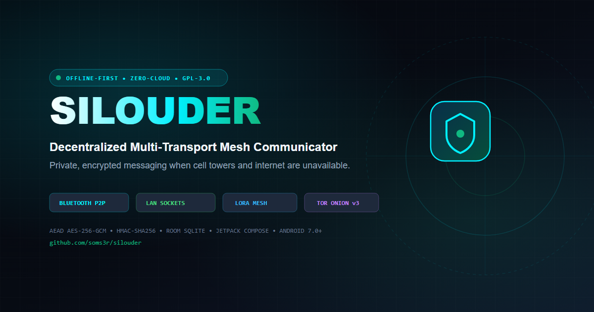

<div align="center">



<br><br>

# 🛡️ Silouder

### Decentralized, Zero-Infrastructure Offline Android Communicator
**E2EE Messaging · P2P VoIP & Tactical Walkie-Talkie · Bluetooth LE · Local Wi-Fi Sockets · LoRa Mesh · Tor Onion**

<br>

[](https://github.com/soms3r/silouder/releases/tag/v1.0.0)
[-10B981?style=for-the-badge&logo=android)](https://github.com/soms3r/silouder/releases/download/v1.0.0/silouder_release_v1.apk)
[](https://soms3r.github.io/silouder/#fdroid-info)
[](LICENSE)
[-8B5CF6?style=for-the-badge&logo=android)](https://developer.android.com)

<br>

[**🌐 Live Website**](https://soms3r.github.io/silouder/) &nbsp;•&nbsp;
[**⬇️ Direct Download APK (v1.0.0)**](https://github.com/soms3r/silouder/releases/download/v1.0.0/silouder_release_v1.apk) &nbsp;•&nbsp;
[**📦 All Releases**](https://github.com/soms3r/silouder/releases) &nbsp;•&nbsp;
[**📖 Maintainer Guide**](MAINTAINER_GUIDE.md) &nbsp;•&nbsp;
[**🤝 Contributing**](CONTRIBUTING.md)

</div>

---

## 💡 Why Silouder?

Traditional messengers (WhatsApp, Telegram, Signal) depend entirely on central servers, cellular towers, ISP cables, and phone numbers. **When the power grid fails, natural disasters strike, protests occur, or you enter remote wilderness, standard communication stops working.**

**Silouder turns your Android device into a sovereign communicator.** It connects directly device-to-device through multiple physical and radio layers with zero central infrastructure, zero tracking, and military-grade encryption.

---

## ⚡ Key Highlights & Capabilities

- 🔒 **End-to-End Cryptography (AES-256-GCM AEAD)**: Every message, voice note, and packet is encrypted locally with a fresh 96-bit random IV and verified via HMAC-SHA256 signatures before leaving the phone.
- 📡 **Multi-Transport Fallback**: Dispatches traffic automatically across Bluetooth LE, local Wi-Fi / hotspot sockets, LoRa radio modems, and Tor onion circuits.
- 🎙️ **P2P Audio Calling & Tactical Walkie-Talkie (PTT)**: Real-time 16kHz PCM duplex voice calls and push-to-talk voice bursts over local networks without VoIP servers.
- 📻 **Encrypted Voice Notes & Attachments**: Integrated AAC/M4A voice recorder with interactive waveforms and internal sandboxed file transfers.
- 🔄 **Store-and-Forward Outbox Gossip**: Messages are queued locally in Room SQLite and automatically gossip-flushed when any peer node comes within range.
- 🛡️ **Zero Phone Numbers, Zero Cloud**: Cryptographic identities (Ed25519/ECDH keys + Node IDs like `!7a9f1b2c`) are generated offline from hardware entropy.
- 🆓 **100% Free & Open Source**: Licensed under GNU GPL-3.0 with zero proprietary blobs, zero analytics, and zero Google Play Services requirements.

---

## 📱 Quick Download & Sideloading (3 Easy Steps)

You do **not** need a Google account or Google Play Store to install Silouder.

```text
Step 1: Download the official signed production APK:
        👉 silouder_release_v1.apk (11.3 MB)
        URL: https://github.com/soms3r/silouder/releases/download/v1.0.0/silouder_release_v1.apk

Step 2: Tap the downloaded file. If Android prompts you, enable:
        "Install unknown apps" for your browser or file manager.

Step 3: Open Silouder! Your cryptographic keys and node identity
        are generated locally on the device upon first launch.
```

> [!TIP]
> **F-Droid Release Status**: Silouder has been submitted to the official F-Droid catalog and is currently undergoing inclusion review. You can install the signed GitHub release APK in the meantime.

---

## 🛰️ Multi-Transport Matrix

| Transport Layer | Technology & Ports | Range | Typical Scenarios |
|---|---|---|---|
| **Nearby Bluetooth** | BLE Scanner, Advertiser & GATT Server | ~10 – 30 meters | Subways, airplanes, concerts, close-quarters tactical sync |
| **Local Wi-Fi / Hotspot** | TCP Sockets (Port 8888) + mDNS (`NsdManager`) | ~50 – 150 meters | Emergency shelters, home LANs, portable hotspot hubs |
| **Tactical Voice / VoIP** | UDP Audio Streaming (Port 8899) | LAN / Hotspot | Walkie-talkie PTT bursts, real-time voice calling |
| **LoRa Radio Mesh** | SX1262 LoRa BLE (Meshtastic 915/868 MHz) | 1 – 15+ km | Mountain expeditions, disaster zones, off-grid search & rescue |
| **Tor Onion v3** | Deterministic `.onion` Sockets | Global Internet | Anonymous communication over censored or monitored connections |

---

## 🏗️ Architecture & Codebase Layout

Silouder is built natively in **Kotlin** and **Jetpack Compose** following modern Clean Architecture principles:

```text
app/src/main/java/com/silouder/app/
├── crypto/
│   └── CryptoEngine.kt          # AES-256-GCM AEAD, HMAC-SHA256, secure IV generation
├── data/
│   ├── AppDatabase.kt           # Room SQLite persistence
│   ├── MeshRepository.kt        # Reactive repository for peers, messages, and channels
│   └── *Entity.kt               # Database schemas (Messages, Channels, Nodes, Outbox)
├── media/
│   ├── P2PCallManager.kt        # 16kHz PCM duplex voice streaming & UDP socket signaling
│   └── FileManager.kt           # AES-encrypted audio notes & attachment sandbox
├── model/
│   ├── MeshNode.kt              # Peer node model, transports, and signal metrics
│   ├── UnifiedMessage.kt        # Canonical message envelope
│   └── PacketTrace.kt           # Tactical diagnostic wire inspection model
├── service/
│   └── SilouderMeshService.kt   # Persistent Android foreground service for background mesh
├── sync/
│   └── BriarSyncEngine.kt       # Anti-entropy gossip protocol & sync vector hashing
├── transport/
│   ├── bluetooth/               # Android Bluetooth LE scanner, advertiser, and GATT server
│   ├── network/                 # Multi-threaded TCP server (8888) & NsdManager mDNS zero-conf
│   ├── meshtastic/              # LoRa SX1262 modem BLE transceiver & MTU framer
│   ├── tor/                     # Tor session layer & v3 onion address derivation
│   └── router/TransportRouter.kt# Unified routing layer with dynamic priority failover
└── ui/
    ├── screens/                 # Modern Jetpack Compose UI (Chat, HUD, KeyRing, Radio, Settings)
    ├── theme/                   # Tactical dark cyberpunk theme & color tokens
    └── SilouderViewModel.kt     # Unidirectional Data Flow (UDF) state machine
```

---

## 🛠️ Building From Source

### Prerequisites
- **JDK 17** or **JDK 21**
- **Android SDK 36** (minSdk 24 for Android 7.0+)
- **Android Studio Ladybug / Meerkat** (or command-line Gradle)

### 1. Clone the Repository
```bash
git clone https://github.com/soms3r/silouder.git
cd silouder
```

### 2. Build Debug APK
```bash
./gradlew assembleDebug
```
The output APK is generated at: `app/build/outputs/apk/debug/app-debug.apk`

### 3. Run Automated Unit Tests
```bash
./gradlew testDebugUnitTest
```

### 4. Build Signed Release APK
To sign your release APK using environment variables:
```bash
KEYSTORE_PATH="/path/to/silouder-release.jks" \
STORE_PASSWORD="your_keystore_password" \
KEY_ALIAS="your_key_alias" \
KEY_PASSWORD="your_key_password" \
./gradlew assembleRelease
```
The output APK is generated at: `app/build/outputs/apk/release/silouder_release_v1.apk`

---

## 🔒 Security Model & Privacy Guarantees

Silouder is designed with a zero-trust model:
1. **No Accounts or PII**: You never provide a name, email address, phone number, or password.
2. **Deterministic Cryptographic Keys**: Every identity is generated locally via `SecureRandom` and stored inside Android's private app sandbox.
3. **AEAD Ciphertext in Transit**: Intermediate mesh repeater nodes only forward ciphertext envelopes; they cannot inspect or forge message payloads.
4. **Zero Analytics & Zero Google Services**: No Google Play Services, Firebase, crashlytics, or telemetry SDKs are bundled.

---

## 🤝 Contributing

We welcome contributions from mesh radio operators, cryptographers, Android developers, and privacy advocates!
- Read our [CONTRIBUTING.md](CONTRIBUTING.md) guide.
- Check out the [MAINTAINER_GUIDE.md](MAINTAINER_GUIDE.md) for release workflows and GitHub Actions automation.

---

## 📄 License & Credits

Silouder is published under the **GNU General Public License v3.0 (GPL-3.0)**. See the [LICENSE](LICENSE) file for the complete license terms.

### Inspiration & Protocol References
- [Meshtastic](https://meshtastic.org) (GPL-3.0) — Sub-GHz LoRa mesh concepts & radio framing.
- [Briar Project](https://briarproject.org) (AGPL-3.0) — Anti-entropy vector sync & local transport resilience.
- [The Tor Project](https://torproject.org) (BSD-3) — Decentralized onion routing ideas.

---

<div align="center">
  <sub>Engineered by Somser Ali for open, sovereign, and resilient communication worldwide.</sub>
</div>
